    library(tidyverse)

    ## Warning: package 'ggplot2' was built under R version 4.4.3

    ## Warning: package 'tibble' was built under R version 4.4.3

    ## Warning: package 'tidyr' was built under R version 4.4.3

    ## Warning: package 'readr' was built under R version 4.4.3

    ## Warning: package 'purrr' was built under R version 4.4.3

    ## Warning: package 'dplyr' was built under R version 4.4.3

    ## ── Attaching core tidyverse packages ──────────────────────── tidyverse 2.0.0 ──
    ## ✔ dplyr     1.2.0     ✔ readr     2.1.6
    ## ✔ forcats   1.0.1     ✔ stringr   1.6.0
    ## ✔ ggplot2   4.0.2     ✔ tibble    3.3.1
    ## ✔ lubridate 1.9.4     ✔ tidyr     1.3.2
    ## ✔ purrr     1.2.1     
    ## ── Conflicts ────────────────────────────────────────── tidyverse_conflicts() ──
    ## ✖ dplyr::filter() masks stats::filter()
    ## ✖ dplyr::lag()    masks stats::lag()
    ## ℹ Use the conflicted package (<http://conflicted.r-lib.org/>) to force all conflicts to become errors

    library(plotly)

    ## Warning: package 'plotly' was built under R version 4.4.3

    ## 
    ## Attaching package: 'plotly'
    ## 
    ## The following object is masked from 'package:ggplot2':
    ## 
    ##     last_plot
    ## 
    ## The following object is masked from 'package:stats':
    ## 
    ##     filter
    ## 
    ## The following object is masked from 'package:graphics':
    ## 
    ##     layout

    library(regclass)

    ## Loading required package: bestglm
    ## Loading required package: leaps
    ## Loading required package: VGAM

    ## Warning: package 'VGAM' was built under R version 4.4.3

    ## Loading required package: stats4
    ## Loading required package: splines
    ## Loading required package: rpart
    ## Loading required package: randomForest
    ## randomForest 4.7-1.2
    ## Type rfNews() to see new features/changes/bug fixes.
    ## 
    ## Attaching package: 'randomForest'
    ## 
    ## The following object is masked from 'package:dplyr':
    ## 
    ##     combine
    ## 
    ## The following object is masked from 'package:ggplot2':
    ## 
    ##     margin
    ## 
    ## Important regclass change from 1.3:
    ## All functions that had a . in the name now have an _
    ## all.correlations -> all_correlations, cor.demo -> cor_demo, etc.

The very first action taken, before the project began, was downloading
nearby precipitation data from this site:
<https://www.ncei.noaa.gov/access/past-weather/Woodstock%2C%20Illinois.>

This was later visualized against the soil water content data from the
field site.

    ## Warning: One or more parsing issues, call `problems()` on your data frame for details,
    ## e.g.:
    ##   dat <- vroom(...)
    ##   problems(dat)

    ## Rows: 6525 Columns: 7
    ## ── Column specification ────────────────────────────────────────────────────────
    ## Delimiter: ","
    ## chr (1): Date
    ## dbl (3): PRCP (Inches), SNOW (Inches), SNWD (Inches)
    ## lgl (3): TAVG (Degrees Fahrenheit), TMAX (Degrees Fahrenheit), TMIN (Degrees...
    ## 
    ## ℹ Use `spec()` to retrieve the full column specification for this data.
    ## ℹ Specify the column types or set `show_col_types = FALSE` to quiet this message.

    ## Warning: One or more parsing issues, call `problems()` on your data frame for details,
    ## e.g.:
    ##   dat <- vroom(...)
    ##   problems(dat)

    ## Rows: 6402 Columns: 7
    ## ── Column specification ────────────────────────────────────────────────────────
    ## Delimiter: ","
    ## chr (1): Date
    ## dbl (3): PRCP (Inches), SNOW (Inches), SNWD (Inches)
    ## lgl (3): TAVG (Degrees Fahrenheit), TMAX (Degrees Fahrenheit), TMIN (Degrees...
    ## 
    ## ℹ Use `spec()` to retrieve the full column specification for this data.
    ## ℹ Specify the column types or set `show_col_types = FALSE` to quiet this message.

    ## Warning: One or more parsing issues, call `problems()` on your data frame for details,
    ## e.g.:
    ##   dat <- vroom(...)
    ##   problems(dat)

    ## Rows: 8208 Columns: 7
    ## ── Column specification ────────────────────────────────────────────────────────
    ## Delimiter: ","
    ## chr (1): Date
    ## dbl (3): PRCP (Inches), SNOW (Inches), SNWD (Inches)
    ## lgl (3): TAVG (Degrees Fahrenheit), TMAX (Degrees Fahrenheit), TMIN (Degrees...
    ## 
    ## ℹ Use `spec()` to retrieve the full column specification for this data.
    ## ℹ Specify the column types or set `show_col_types = FALSE` to quiet this message.

I then prepared the data for visualization and analysis by reformatting
each date field to date class, filtering rows for 2025, and combining
each station’s data into a single dataset.

    Woodstock_0.7_SW_data<-Woodstock_0.7_SW_data%>%
      mutate(Date=ymd(Date))%>%
      mutate(Year=year(Date), Month=month(Date), Day=day(Date))%>%
      filter(Year==2025)%>%
      select(c(1,5,8,9,10))

    ## Warning: There was 1 warning in `mutate()`.
    ## ℹ In argument: `Date = ymd(Date)`.
    ## Caused by warning:
    ## !  2 failed to parse.

    Woodstock_3.8_SW_data<-Woodstock_3.8_SW_data%>%
      mutate(Date=ymd(Date))%>%
      mutate(Year=year(Date), Month=month(Date), Day=day(Date))%>%
      filter(Year==2025)%>%
      select(c(1,5,8,9,10))

    ## Warning: There was 1 warning in `mutate()`.
    ## ℹ In argument: `Date = ymd(Date)`.
    ## Caused by warning:
    ## !  2 failed to parse.

    Woodstock_5_NW_data<-Woodstock_5_NW_data%>%
      mutate(Date=ymd(Date))%>%
      mutate(Year=year(Date), Month=month(Date), Day=day(Date))%>%
      filter(Year==2025)%>%
      select(c(1,5,8,9,10))

    ## Warning: There was 1 warning in `mutate()`.
    ## ℹ In argument: `Date = ymd(Date)`.
    ## Caused by warning:
    ## !  2 failed to parse.

    Woodstock_combined_weather_data<-Woodstock_0.7_SW_data%>%
      left_join(Woodstock_3.8_SW_data, by=c("Date"="Date"))%>%
      left_join(Woodstock_5_NW_data, by=c("Date"="Date"))%>%
      select(1,2,6,10)

    names(Woodstock_combined_weather_data)<-c("Date","SW_0.7_Precip", "SW_3.8_Precip", "NW_5_Precip")

At the onset of my Environmental Research class in January, I obtained
the onsite soil moisture data from my professor, which includes moisture
data from November 10, 2024 (just after being installed) to October 6,
2025.

    six_LUREC_water_sensor_data<-read_csv("~/Desktop/Ghatak_research_project/6_LUREC_soil_water_sensors.csv")

    ## New names:
    ## Rows: 7918 Columns: 9
    ## ── Column specification
    ## ──────────────────────────────────────────────────────── Delimiter: "," chr
    ## (9): z6B03659, Port 1, Port 2, Port 3, Port 4, Port 5, Port 6, Port 7......
    ## ℹ Use `spec()` to retrieve the full column specification for this data. ℹ
    ## Specify the column types or set `show_col_types = FALSE` to quiet this message.
    ## • `Port 7` -> `Port 7...8`
    ## • `Port 7` -> `Port 7...9`

    six__more_LUREC_water_sensors<-read_csv("~/Desktop/Ghatak_research_project/6_more_LUREC_water_sensors.csv")

    ## New names:
    ## Rows: 7912 Columns: 9
    ## ── Column specification
    ## ──────────────────────────────────────────────────────── Delimiter: "," chr
    ## (9): z6B03782, Port 1, Port 2, Port 3, Port 4, Port 5, Port 6, Port 7......
    ## ℹ Use `spec()` to retrieve the full column specification for this data. ℹ
    ## Specify the column types or set `show_col_types = FALSE` to quiet this message.
    ## • `Port 7` -> `Port 7...8`
    ## • `Port 7` -> `Port 7...9`

Each dataset contains readings from a single data logger, which receives
data from six of the twelve sensors (2 datasets = 2 data loggers = 12
total sensors).

I then performed some basic data cleaning, including removal of column
headers that were formatted as observations and renaming columns to
prevent word splitting issues, and changing water content readings from
character to numeric class.

    six_LUREC_water_sensor_data_new<-six_LUREC_water_sensor_data%>%
    tail(7916)
    colnames(six_LUREC_water_sensor_data_new)<-c("Timestamp", "Pot_1_Water_Content_proportion", "Pot_2_Water_Content_proportion", "Pot_3_Water_Content_proportion", "Pot_4_Water_Content_proportion", "Pot_5_Water_Content_proportion", "Pot_6_Water_Content_proportion", "Battery_percent", "Battery_voltage_mV")

    six__more_LUREC_water_sensors_new<-six__more_LUREC_water_sensors%>%
    tail(7910)
    colnames(six__more_LUREC_water_sensors_new)<-c("Timestamp", "Pot_7_Water_Content_proportion", "Pot_8_Water_Content_proportion", "Pot_9_Water_Content_proportion", "Pot_10_Water_Content_proportion", "Pot_11_Water_Content_proportion", "Pot_12_Water_Content_proportion", "Battery_percent", "Battery_voltage_mV")

    rm(six_LUREC_water_sensor_data, six__more_LUREC_water_sensors)

    six_LUREC_water_sensor_data_new<-six_LUREC_water_sensor_data_new%>%
    mutate(Pot_1_Water_Content_proportion=as.numeric(Pot_1_Water_Content_proportion))%>%
    mutate(Pot_2_Water_Content_proportion=as.numeric(Pot_2_Water_Content_proportion))%>%
    mutate(Pot_3_Water_Content_proportion=as.numeric(Pot_3_Water_Content_proportion))%>%
    mutate(Pot_4_Water_Content_proportion=as.numeric(Pot_4_Water_Content_proportion))%>%
    mutate(Pot_5_Water_Content_proportion=as.numeric(Pot_5_Water_Content_proportion))%>%
    mutate(Pot_6_Water_Content_proportion=as.numeric(Pot_6_Water_Content_proportion))

    six_more_LUREC_water_sensors_new<-six__more_LUREC_water_sensors_new%>%
      mutate(Pot_7_Water_Content_proportion=as.numeric(Pot_7_Water_Content_proportion))%>%
      mutate(Pot_8_Water_Content_proportion=as.numeric(Pot_8_Water_Content_proportion))%>%
      mutate(Pot_9_Water_Content_proportion=as.numeric(Pot_9_Water_Content_proportion))%>%
      mutate(Pot_10_Water_Content_proportion=as.numeric(Pot_10_Water_Content_proportion))%>%
      mutate(Pot_11_Water_Content_proportion=as.numeric(Pot_11_Water_Content_proportion))%>%
      mutate(Pot_12_Water_Content_proportion=as.numeric(Pot_12_Water_Content_proportion))

    ## Warning: There was 1 warning in `mutate()`.
    ## ℹ In argument: `Pot_7_Water_Content_proportion =
    ##   as.numeric(Pot_7_Water_Content_proportion)`.
    ## Caused by warning:
    ## ! NAs introduced by coercion

    ## Warning: There was 1 warning in `mutate()`.
    ## ℹ In argument: `Pot_10_Water_Content_proportion =
    ##   as.numeric(Pot_10_Water_Content_proportion)`.
    ## Caused by warning:
    ## ! NAs introduced by coercion

    rm(six__more_LUREC_water_sensors_new)

    six_LUREC_water_sensor_data_new<-six_LUREC_water_sensor_data_new%>%
    tail(7915)
    Combined_LUREC_water_data<-six_LUREC_water_sensor_data_new%>%
    left_join(six_more_LUREC_water_sensors_new, by=c("Timestamp"="Timestamp"))

I then investigated the distribution of each pot’s water content.

    Averaged_LUREC_water_data<-Combined_LUREC_water_data%>%
    mutate(Timestamp=mdy_hm(Timestamp))%>%
    mutate(Day=format(Timestamp, format= "%d"), Month=format(Timestamp, format="%m"), Year=format(Timestamp, format="%y"))%>%
    mutate(Date=str_c(Month, "/", Day, "/", Year))%>%
    mutate(Date=mdy(Date))%>%
    group_by(Date)%>%
    summarize(Pot_1_mean_water_content=mean(Pot_1_Water_Content_proportion), Pot_2_mean_water_content=mean(Pot_2_Water_Content_proportion), Pot_3_mean_water_content=mean(Pot_3_Water_Content_proportion), Pot_4_mean_water_content=mean(Pot_4_Water_Content_proportion), Pot_5_mean_water_content=mean(Pot_5_Water_Content_proportion), Pot_6_mean_water_content=mean(Pot_6_Water_Content_proportion), Pot_7_mean_water_content=mean(Pot_7_Water_Content_proportion), Pot_8_mean_water_content=mean(Pot_8_Water_Content_proportion), Pot_9_mean_water_content=mean(Pot_9_Water_Content_proportion), Pot_10_mean_water_content=mean(Pot_10_Water_Content_proportion), Pot_11_mean_water_content=mean(Pot_11_Water_Content_proportion), Pot_12_mean_water_content=mean(Pot_12_Water_Content_proportion))    

    Water_content_precipitation_combined<-Averaged_LUREC_water_data%>%
    left_join(Woodstock_combined_weather_data, by=c("Date"="Date"))%>%
    mutate(Avg_MWC=(Pot_1_mean_water_content+Pot_2_mean_water_content+Pot_3_mean_water_content+Pot_4_mean_water_content+Pot_5_mean_water_content+Pot_6_mean_water_content+Pot_7_mean_water_content+Pot_8_mean_water_content+Pot_9_mean_water_content+Pot_10_mean_water_content+Pot_11_mean_water_content+Pot_12_mean_water_content)/12)%>%
    select(-17)

    colnames(Water_content_precipitation_combined)=c("Date", "Pot_1_MWC", "Pot_2_MWC", "Pot_3_MWC", "Pot_4_MWC", "Pot_5_MWC", "Pot_6_MWC", "Pot_7_MWC", "Pot_8_MWC", "Pot_9_MWC", "Pot_10_MWC", "Pot_11_MWC", "Pot_12_MWC","PRCP_x", "PRCP_y", "PRCP_z")
    Water_content_precipitation_combined<-Water_content_precipitation_combined%>%
    mutate(Avg_precip=(PRCP_x+PRCP_y+PRCP_z)/3)

    Combined_LUREC_water_data<-six_LUREC_water_sensor_data_new%>%
    tail(7915)%>%
    left_join(six_more_LUREC_water_sensors_new, by=c("Timestamp"="Timestamp"))

    Combined_LUREC_water_data_pivoted<-Combined_LUREC_water_data%>%
    select(-Battery_percent.x, -Battery_voltage_mV.x, -Battery_percent.y, -Battery_voltage_mV.y)%>%
    pivot_longer(cols=-Timestamp, names_to="Pot", values_to="Water_content")

    Combined_LUREC_water_data_pivoted$Pot<-rep(1:12, 7915)
    Combined_LUREC_water_data_pivoted$Pot<-as.factor(Combined_LUREC_water_data_pivoted$Pot)

    Pot_water_content_boxplots<-plot_ly(data=Combined_LUREC_water_data_pivoted, color=~Pot, y=~Water_content, type="box")%>%
    layout(title="Comparative boxplots of Water Content for Each LUREC Pot", xaxis=list(title="Pot Number"), yaxis=list(title="Water content (m^3 water/m^3 soil"))
    Pot_water_content_boxplots

    ## Warning: Ignoring 2999 observations

    ## Warning in RColorBrewer::brewer.pal(max(N, 3L), "Set2"): n too large, allowed maximum for palette Set2 is 8
    ## Returning the palette you asked for with that many colors
    ## Warning in RColorBrewer::brewer.pal(max(N, 3L), "Set2"): n too large, allowed maximum for palette Set2 is 8
    ## Returning the palette you asked for with that many colors

Creating this boxplot made it visually apparent that pots 5 and 8
contained negative values. Since soil moisture content is measured as a
proportion of cubic meters of water per cubic meter of soil, negative
moisture readings make no sense.

I then investigated when these negative readings occured.

    Pot_5_negative_values<-Combined_LUREC_water_data%>%
    select(Timestamp, Pot_5_Water_Content_proportion)%>%
    filter(Pot_5_Water_Content_proportion<0)

    Pot_8_negative_values<-Combined_LUREC_water_data%>%
    select(Timestamp, Pot_8_Water_Content_proportion)%>%
    filter(Pot_8_Water_Content_proportion<0)

The sensor in Pot 5 recorded negative values for water content at each
hour mark from 1/21/25 at 9:00 AM to 1/22/25 at 7:00 PM. The sensor in
Pot 8 recorded negative values for water content at each hour mark from
10:00 AM to 5:00 PM on 1/21/26. The negative values then discontinue and
begin again from 12:00 AM to 5:00 PM on 1/22/25.

Based on this information and the locations of large clusters of NA
values between the months of November and January for 2 of the pots, I
decided to remove all observations at or before 2/3/25, after averaging
the observations by day. This was the dataset used for all subsequent
analyses.

    Averaged_LUREC_water_data<-Combined_LUREC_water_data%>%
    mutate(Timestamp=mdy_hm(Timestamp))%>%
    mutate(Day=format(Timestamp, format= "%d"), Month=format(Timestamp, format="%m"), Year=format(Timestamp, format="%y"))%>%
    mutate(Date=str_c(Month, "/", Day, "/", Year))%>%
    mutate(Date=mdy(Date))%>%
    group_by(Date)%>%
    summarize(Pot_1_mean_water_content=mean(Pot_1_Water_Content_proportion), Pot_2_mean_water_content=mean(Pot_2_Water_Content_proportion), Pot_3_mean_water_content=mean(Pot_3_Water_Content_proportion), Pot_4_mean_water_content=mean(Pot_4_Water_Content_proportion), Pot_5_mean_water_content=mean(Pot_5_Water_Content_proportion), Pot_6_mean_water_content=mean(Pot_6_Water_Content_proportion), Pot_7_mean_water_content=mean(Pot_7_Water_Content_proportion), Pot_8_mean_water_content=mean(Pot_8_Water_Content_proportion), Pot_9_mean_water_content=mean(Pot_9_Water_Content_proportion), Pot_10_mean_water_content=mean(Pot_10_Water_Content_proportion), Pot_11_mean_water_content=mean(Pot_11_Water_Content_proportion), Pot_12_mean_water_content=mean(Pot_12_Water_Content_proportion)) 

    Water_content_precipitation_combined<-Averaged_LUREC_water_data%>%
    left_join(Woodstock_combined_weather_data, by=c("Date"="Date"))%>%
    mutate(Avg_MWC=(Pot_1_mean_water_content+Pot_2_mean_water_content+Pot_3_mean_water_content+Pot_4_mean_water_content+Pot_5_mean_water_content+Pot_6_mean_water_content+Pot_7_mean_water_content+Pot_8_mean_water_content+Pot_9_mean_water_content+Pot_10_mean_water_content+Pot_11_mean_water_content+Pot_12_mean_water_content)/12)

    Useful_LUREC_averaged_data<-Water_content_precipitation_combined%>%
    filter(Date > "2025-02-03")

I then created a three-axis time series graph displaying daily averaged
water content against the daily precipitation and maximum temperature at
the Crystal Lake 4 NW weather station (the only weather station near the
field site with both temperature and precipitation data for 2025). Data
for this weather station was downloaded from the same website as the
three Woodstock stations.

    library(tidyverse)
    Crystal_Lake_temperature_data<-read_csv("~/Desktop/Ghatak_research_project/Crystal_Lake_Temperature_data.csv")

    ## Warning: One or more parsing issues, call `problems()` on your data frame for details,
    ## e.g.:
    ##   dat <- vroom(...)
    ##   problems(dat)

    ## Rows: 12584 Columns: 7
    ## ── Column specification ────────────────────────────────────────────────────────
    ## Delimiter: ","
    ## chr (1): Column1
    ## dbl (5): Column3, Column4, Column5, Column6, Column7
    ## lgl (1): Column2
    ## 
    ## ℹ Use `spec()` to retrieve the full column specification for this data.
    ## ℹ Specify the column types or set `show_col_types = FALSE` to quiet this message.

    colnames(Crystal_Lake_temperature_data)<-c("Date", "Average_Temp_F", "Max_Temp_F", "Min_Temp_F", "PRCP_inches", "Snow_inches", "SNWD_inches")
    Crystal_Lake_temperature_data<-Crystal_Lake_temperature_data%>%
    tail(12582)%>%
    mutate(Date=ymd(Date))%>%
    mutate(Year=year(Date), Month=month(Date), Day=day(Date))%>%
    filter(Year==2025)%>%
    tail(417)%>%
    left_join(Averaged_LUREC_water_data, by=c("Date"="Date"))%>%
    filter(Date<"2025-10-07" & Date>"2025-02-03")%>%
    select(-2)%>%
    mutate(Avg_Temp_F=(Max_Temp_F+Min_Temp_F)/2)

    Combined_LUREC_water_data_new<-Combined_LUREC_water_data_pivoted%>%
    mutate(Timestamp=mdy_hm(Timestamp))%>%
    mutate(Day=format(Timestamp, format= "%d"), Month=format(Timestamp, format="%m"), Year=format(Timestamp, format="%y"))%>%
    mutate(Date=str_c(Month, "/", Day, "/", Year))%>%
    mutate(Date=mdy(Date))%>%
    group_by(Date)%>%
    summarize(Average_water_content=mean(Water_content))

    Crystal_Lake_temperature_data<-Crystal_Lake_temperature_data%>%
    left_join(Water_content_precipitation_combined, by=c("Date"="Date"))%>%
    mutate(Avg_precip=(SW_0.7_Precip+SW_3.8_Precip+NW_5_Precip)/3)%>%
    select(c(1,2,3,38,39))

    colnames(Crystal_Lake_temperature_data)<-c("Date", "Max_Temp_F", "Min_Temp_F", "MWC", "Avg_precip")

    Combined_Precip_water_content_max_temp_plot<-plot_ly(data=Crystal_Lake_temperature_data, x=~Date, y=~MWC, name="Mean Water Content(Left)", type="scatter", mode="lines+markers")%>%
      add_trace(x=~Date, y=~Avg_precip, yaxis="y2", name="Average Precip in Inches(Right)", type="bar")%>%  
      add_trace(x=~Date, y=~Max_Temp_F, yaxis="y3",  name="Crystal Lake 4 NW Max temp (Middle)", type="scatter", mode="lines+markers")%>%
      layout(title="Time Series of Mean Water Content, Maximum temperature and precipitation, averaged by day", xaxis=list(title="Date"), yaxis=list(title="Mean Water Content", side="left"), yaxis2=list(title="Crystal Lake precipitation", overlaying="y", side="right"), yaxis3=list(title="Maximum temperature", overlaying="y", position=0.5))
    Combined_Precip_water_content_max_temp_plot

    ## Warning: Ignoring 41 observations

    ## Warning: 'bar' objects don't have these attributes: 'mode'
    ## Valid attributes include:
    ## '_deprecated', 'alignmentgroup', 'base', 'basesrc', 'cliponaxis', 'constraintext', 'customdata', 'customdatasrc', 'dx', 'dy', 'error_x', 'error_y', 'hoverinfo', 'hoverinfosrc', 'hoverlabel', 'hovertemplate', 'hovertemplatesrc', 'hovertext', 'hovertextsrc', 'ids', 'idssrc', 'insidetextanchor', 'insidetextfont', 'legend', 'legendgroup', 'legendgrouptitle', 'legendrank', 'legendwidth', 'marker', 'meta', 'metasrc', 'name', 'offset', 'offsetgroup', 'offsetsrc', 'opacity', 'orientation', 'outsidetextfont', 'selected', 'selectedpoints', 'showlegend', 'stream', 'text', 'textangle', 'textfont', 'textposition', 'textpositionsrc', 'textsrc', 'texttemplate', 'texttemplatesrc', 'transforms', 'type', 'uid', 'uirevision', 'unselected', 'visible', 'width', 'widthsrc', 'x', 'x0', 'xaxis', 'xcalendar', 'xhoverformat', 'xperiod', 'xperiod0', 'xperiodalignment', 'xsrc', 'y', 'y0', 'yaxis', 'ycalendar', 'yhoverformat', 'yperiod', 'yperiod0', 'yperiodalignment', 'ysrc', 'key', 'set', 'frame', 'transforms', '_isNestedKey', '_isSimpleKey', '_isGraticule', '_bbox'

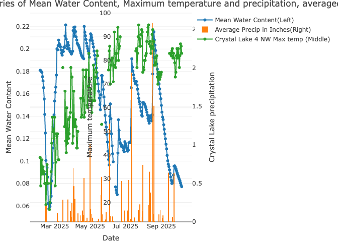

This graph suggested very rapid water infiltration, owing to the very
small time delays ( usually &lt;= 1 day) between precipitation events
and increases in mean water content. It appears that, at certain points
in the months of February and March, mean water content increases
without precipitation, but this is partially due to missingness in the
precipitation data during those months.

At this point, the relationship between maximum temperature and mean
water content was uncertain and was investigated as part of the multiple
linear regression model subsequently generated. The model regressed
daily change in mean water content against daily maximum temperature
from the Crystal Lake 4 NW weather station and the average of daily
precipitation from Crystal Lake 4 NW, Woodstock 5 NW, and Woodstock 3.8
SW.

First, the linearity assumption was assessed using a 3D scatterplot
since two explanatory variables were involved.

    Crystal_Lake_temperature_data<-Crystal_Lake_temperature_data%>%
    mutate(Avg_temp_F=(Min_Temp_F+Max_Temp_F)/2)%>%
    mutate(MWC_daily_change=MWC-lag(MWC))

    Precip_plot<-plot_ly(Crystal_Lake_temperature_data, x=~Max_Temp_F, y=~Avg_precip, z=~MWC_daily_change)%>%
      add_markers()
    Precip_plot

    ## Warning: Ignoring 108 observations

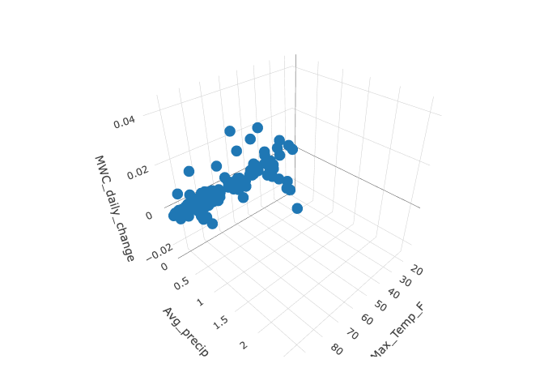

With the linearity assumption apparently satisfied, I generated the
regression plane, checked the homoscedastictiy and residual normality
assumptions, and then added the regression plane to the scatterplot.

    MLR_model<-lm(MWC_daily_change~Max_Temp_F+Avg_precip, data=Crystal_Lake_temperature_data)
    summary(MLR_model)

    ## 
    ## Call:
    ## lm(formula = MWC_daily_change ~ Max_Temp_F + Avg_precip, data = Crystal_Lake_temperature_data)
    ## 
    ## Residuals:
    ##        Min         1Q     Median         3Q        Max 
    ## -0.0212069 -0.0017108 -0.0000999  0.0013923  0.0215998 
    ## 
    ## Coefficients:
    ##               Estimate Std. Error t value Pr(>|t|)    
    ## (Intercept) -3.309e-03  1.859e-03  -1.780   0.0773 .  
    ## Max_Temp_F   5.422e-06  2.633e-05   0.206   0.8372    
    ## Avg_precip   1.945e-02  1.582e-03  12.301   <2e-16 ***
    ## ---
    ## Signif. codes:  0 '***' 0.001 '**' 0.01 '*' 0.05 '.' 0.1 ' ' 1
    ## 
    ## Residual standard error: 0.005763 on 134 degrees of freedom
    ##   (108 observations deleted due to missingness)
    ## Multiple R-squared:  0.5356, Adjusted R-squared:  0.5287 
    ## F-statistic: 77.28 on 2 and 134 DF,  p-value: < 2.2e-16

    plot(MLR_model, 1)

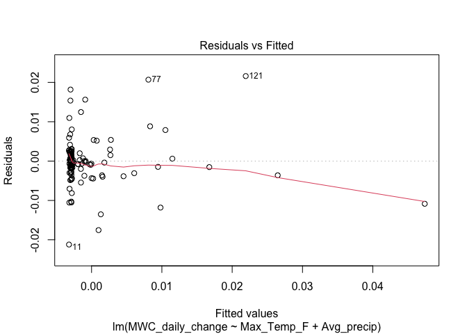

    plot(MLR_model, 2)

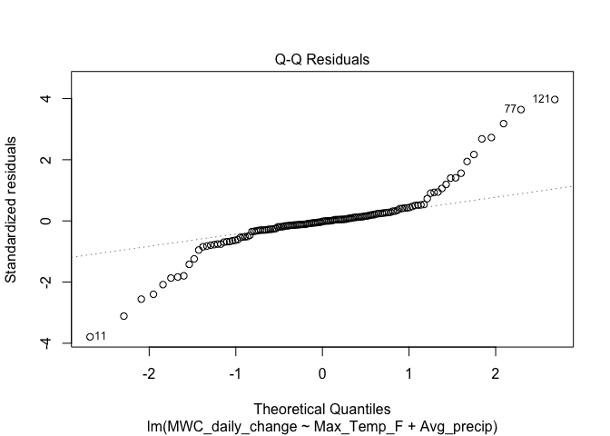

Residuals generally appear scattered around zero. It is difficult to
gauge if a fan shape is present because the precipitation data is very
positively skewed. As I discuss later, this is one of the model’s
primary limitations.

There is a moderate violation of residual normality, with the normal
qqplot appearing linear between -1 and 1 standard deviations of the mean
of MWC\_daily\_change but exhibiting heavy tails on both ends. This
might be alleviated by investigating the three potentially influential
observations (observations 11, 77, and 121) using Jackknife residuals,
testing if each observation is actually influential at alpha=0.01.

    x_seq<-seq(min(Crystal_Lake_temperature_data$Max_Temp_F, na.rm=TRUE), max(Crystal_Lake_temperature_data$Max_Temp_F, na.rm=TRUE), length.out=30)
    y_seq<-seq(min(Crystal_Lake_temperature_data$Avg_precip, na.rm=TRUE), max(Crystal_Lake_temperature_data$Avg_precip, na.rm=TRUE), length.out=30)
    grid<-expand.grid(Avg_precip=y_seq, Max_Temp_F=x_seq)
    grid$MWC_daily_change<-predict(MLR_model, newdata=grid)
    z_matrix<-matrix(grid$MWC_daily_change, nrow=length(y_seq), ncol=length(x_seq), byrow=FALSE)

    Precip_plot <- plot_ly() %>%
      add_markers(data = Crystal_Lake_temperature_data,
                  x = ~Max_Temp_F,
                  y = ~Avg_precip,
                  z = ~MWC_daily_change,
                  marker = list(size = 3)) %>%
      add_surface(x = x_seq,
                  y = y_seq,
                  z = z_matrix,
                  opacity = 0.6)

    Precip_plot

    ## Warning: Ignoring 108 observations

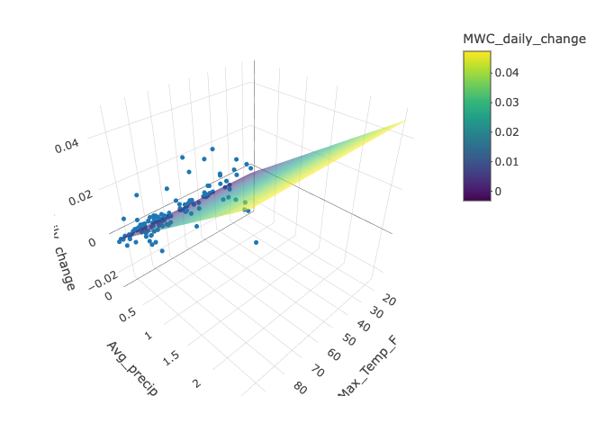

    MWC_model_Jackknife_residuals<-rstudent(MLR_model)
    Crystal_Lake_temperature_data$jackknife_resid <- NA
    used_rows <- as.numeric(rownames(model.frame(MLR_model)))
    Crystal_Lake_temperature_data$jackknife_resid[used_rows] <- MWC_model_Jackknife_residuals

    n=nrow(Crystal_Lake_temperature_data)
    k=3
    p_value_11<-2*pt(abs(Crystal_Lake_temperature_data$jackknife_resid[11]), df=n-k-1, lower.tail=FALSE)

    p_value_77<-2*pt(abs(Crystal_Lake_temperature_data$jackknife_resid[77]), df=n-k-1, lower.tail=FALSE)

    p_value_121<-2*pt(abs(Crystal_Lake_temperature_data$jackknife_resid[121]), df=n-k-1, lower.tail=FALSE)

    p_value_11

    ## [1] 8.523704e-05

    p_value_77

    ## [1] 0.0001690765

    p_value_121

    ## [1] 3.607888e-05

All three observations are statistically influential at alpha=0.01, so I
will remove the observation with the highest absolute Jackknife residual
value and regenerate the model without that observation.

    Crystal_Lake_temperature_data$jackknife_resid[11]

    ## [1] -3.997206

    Crystal_Lake_temperature_data$jackknife_resid[77]

    ## [1] 3.821172

    Crystal_Lake_temperature_data$jackknife_resid[121]

    ## [1] 4.209982

    Crystal_Lake_temperature_data_2<-Crystal_Lake_temperature_data[-121, ]
    new_MLR_model<-lm(MWC_daily_change~Max_Temp_F+Avg_precip, data=Crystal_Lake_temperature_data_2)
    summary(new_MLR_model)

    ## 
    ## Call:
    ## lm(formula = MWC_daily_change ~ Max_Temp_F + Avg_precip, data = Crystal_Lake_temperature_data_2)
    ## 
    ## Residuals:
    ##        Min         1Q     Median         3Q        Max 
    ## -0.0214709 -0.0016659 -0.0000234  0.0013919  0.0217460 
    ## 
    ## Coefficients:
    ##               Estimate Std. Error t value Pr(>|t|)    
    ## (Intercept) -2.965e-03  1.755e-03  -1.690   0.0934 .  
    ## Max_Temp_F   1.181e-06  2.484e-05   0.048   0.9622    
    ## Avg_precip   1.740e-02  1.569e-03  11.094   <2e-16 ***
    ## ---
    ## Signif. codes:  0 '***' 0.001 '**' 0.01 '*' 0.05 '.' 0.1 ' ' 1
    ## 
    ## Residual standard error: 0.005434 on 133 degrees of freedom
    ##   (108 observations deleted due to missingness)
    ## Multiple R-squared:  0.4839, Adjusted R-squared:  0.4761 
    ## F-statistic: 62.35 on 2 and 133 DF,  p-value: < 2.2e-16

    plot(new_MLR_model, 1)

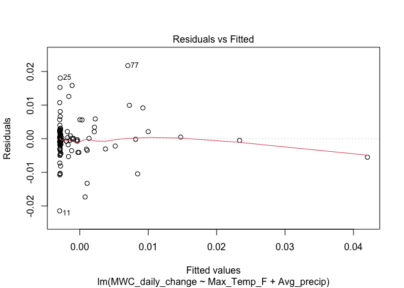

    plot(new_MLR_model, 2)

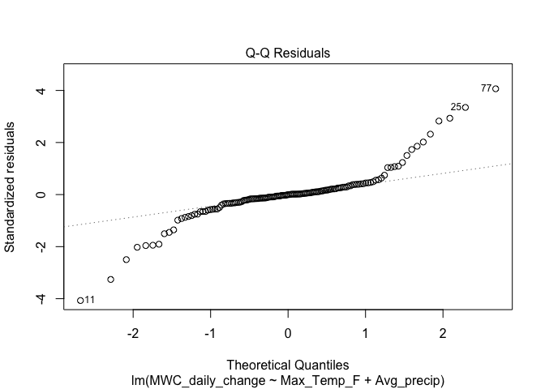
Removing the single influential observation did not significantly
improve the residual normality. Nevertheless, I will continue testing
and removing influential observations one at a time until none remain.

    Jackknife_residuals_2<-rstudent(new_MLR_model)

    Crystal_Lake_temperature_data_2$jackknife_resid <- NA
    used_rows <- as.numeric(rownames(model.frame(new_MLR_model)))
    Crystal_Lake_temperature_data_2$jackknife_resid[used_rows] <- Jackknife_residuals_2

    n2=nrow(Crystal_Lake_temperature_data_2)
    k2=3
    p_value_11_new<-2*pt(abs(Crystal_Lake_temperature_data_2$jackknife_resid[11]), df=n2-k2-1, lower.tail=FALSE)
    p_value_25_new<-2*pt(abs(Crystal_Lake_temperature_data_2$jackknife_resid[25]), df=n2-k2-1, lower.tail=FALSE)
    p_value_77_new<-2*pt(abs(Crystal_Lake_temperature_data_2$jackknife_resid[77]), df=n2-k2-1, lower.tail=FALSE)

    p_value_11_new

    ## [1] 2.149168e-05

    p_value_25_new

    ## [1] 0.0005842025

    p_value_77_new

    ## [1] 2.226054e-05

    #All 3 potentially influential observations are statistically influential

    Crystal_Lake_temperature_data_2$jackknife_resid[11]

    ## [1] -4.33462

    Crystal_Lake_temperature_data_2$jackknife_resid[25]

    ## [1] 3.485347

    Crystal_Lake_temperature_data_2$jackknife_resid[77]

    ## [1] 4.326273

Jackknife residual 11 from the dataset with one observation removed has
the highest absolute residual value, so I will remove it and regenerate
the model again.

    Crystal_Lake_temperature_data_3<-Crystal_Lake_temperature_data_2[-11, ]
    MLR_model_v3<-lm(MWC_daily_change~Max_Temp_F+Avg_precip, data=Crystal_Lake_temperature_data_3)
    summary(MLR_model_v3)

    ## 
    ## Call:
    ## lm(formula = MWC_daily_change ~ Max_Temp_F + Avg_precip, data = Crystal_Lake_temperature_data_3)
    ## 
    ## Residuals:
    ##        Min         1Q     Median         3Q        Max 
    ## -0.0184312 -0.0016873 -0.0001627  0.0013221  0.0213037 
    ## 
    ## Coefficients:
    ##               Estimate Std. Error t value Pr(>|t|)    
    ## (Intercept) -1.202e-03  1.697e-03  -0.708    0.480    
    ## Max_Temp_F  -2.206e-05  2.394e-05  -0.921    0.359    
    ## Avg_precip   1.737e-02  1.473e-03  11.790   <2e-16 ***
    ## ---
    ## Signif. codes:  0 '***' 0.001 '**' 0.01 '*' 0.05 '.' 0.1 ' ' 1
    ## 
    ## Residual standard error: 0.005104 on 132 degrees of freedom
    ##   (108 observations deleted due to missingness)
    ## Multiple R-squared:  0.5131, Adjusted R-squared:  0.5057 
    ## F-statistic: 69.55 on 2 and 132 DF,  p-value: < 2.2e-16

    plot(MLR_model_v3, 1)

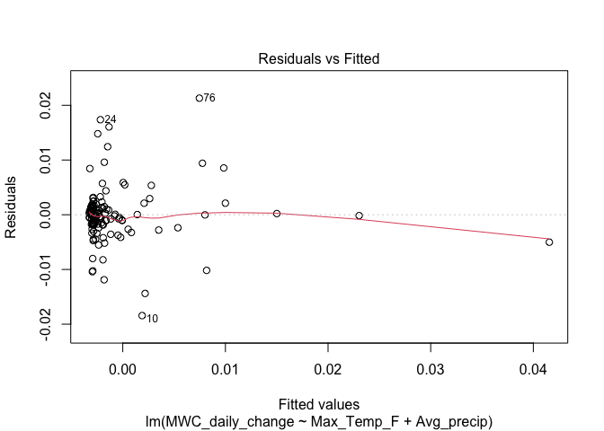

    plot(MLR_model_v3, 2)

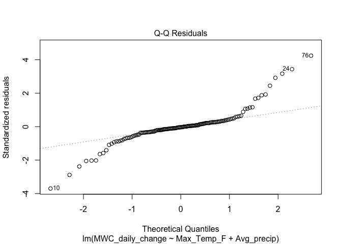

    Jackknife_residuals_3<-rstudent(MLR_model_v3)

    Crystal_Lake_temperature_data_3$jackknife_resid <- NA
    used_rows <- as.numeric(rownames(model.frame(MLR_model_v3)))
    Crystal_Lake_temperature_data_3$jackknife_resid[used_rows] <- Jackknife_residuals_3

    n3=nrow(Crystal_Lake_temperature_data_3)
    k3=3
    p_value_10_new<-2*pt(abs(Crystal_Lake_temperature_data_3$jackknife_resid[10]), df=n3-k3-1, lower.tail=FALSE)
    p_value_24_new<-2*pt(abs(Crystal_Lake_temperature_data_3$jackknife_resid[24]), df=n3-k3-1, lower.tail=FALSE)
    p_value_76_new<-2*pt(abs(Crystal_Lake_temperature_data_3$jackknife_resid[76]), df=n3-k3-1, lower.tail=FALSE)

    p_value_10_new

    ## [1] 0.000129284

    p_value_24_new

    ## [1] 0.0004091711

    p_value_76_new

    ## [1] 8.730041e-06

    Crystal_Lake_temperature_data_3$jackknife_resid[10]

    ## [1] -3.891415

    Crystal_Lake_temperature_data_3$jackknife_resid[24]

    ## [1] 3.584605

    Crystal_Lake_temperature_data_3$jackknife_resid[76]

    ## [1] 4.544929

Observation 76 from the dataset with two influential observations
removed has the highest absolute residual value, so I will remove it and
regenerate the model for the third time.

    Crystal_Lake_temperature_data_4<-Crystal_Lake_temperature_data_3[-76, ]
    MLR_model_v4<-lm(MWC_daily_change~Max_Temp_F+Avg_precip, data=Crystal_Lake_temperature_data_4)
    summary(MLR_model_v4)

    ## 
    ## Call:
    ## lm(formula = MWC_daily_change ~ Max_Temp_F + Avg_precip, data = Crystal_Lake_temperature_data_4)
    ## 
    ## Residuals:
    ##        Min         1Q     Median         3Q        Max 
    ## -0.0178571 -0.0015741 -0.0000858  0.0013511  0.0176051 
    ## 
    ## Coefficients:
    ##               Estimate Std. Error t value Pr(>|t|)    
    ## (Intercept) -1.801e-03  1.589e-03  -1.133    0.259    
    ## Max_Temp_F  -1.437e-05  2.240e-05  -0.641    0.522    
    ## Avg_precip   1.648e-02  1.388e-03  11.867   <2e-16 ***
    ## ---
    ## Signif. codes:  0 '***' 0.001 '**' 0.01 '*' 0.05 '.' 0.1 ' ' 1
    ## 
    ## Residual standard error: 0.004761 on 131 degrees of freedom
    ##   (108 observations deleted due to missingness)
    ## Multiple R-squared:  0.519,  Adjusted R-squared:  0.5117 
    ## F-statistic: 70.67 on 2 and 131 DF,  p-value: < 2.2e-16

    plot(MLR_model_v4, 1)

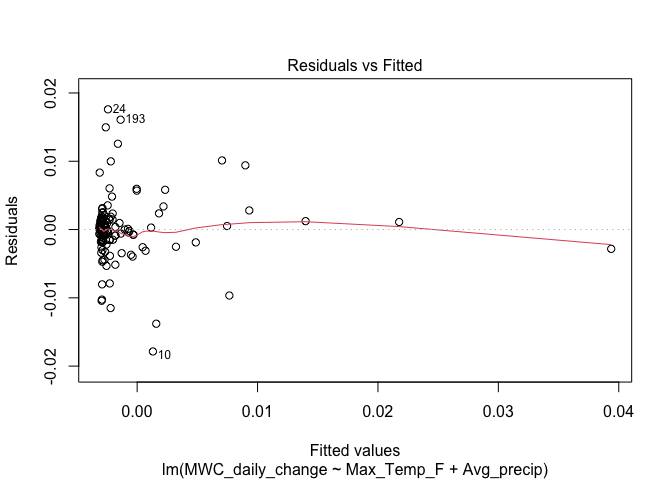

    plot(MLR_model_v4, 2)

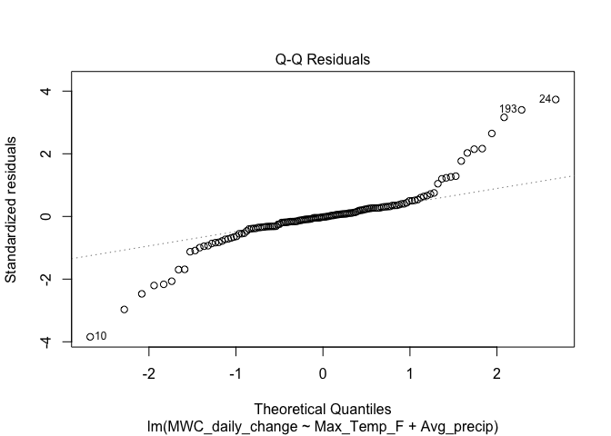

    #Observations 10, 193, and 24 appear potentially influential.

    Jackknife_residuals_4<-rstudent(MLR_model_v4)

    Crystal_Lake_temperature_data_4$jackknife_resid <- NA
    used_rows <- as.numeric(rownames(model.frame(MLR_model_v4)))
    Crystal_Lake_temperature_data_4$jackknife_resid[used_rows] <- Jackknife_residuals_4

    n4=nrow(Crystal_Lake_temperature_data_4)
    k4=3
    p_value_10_new<-2*pt(abs(Crystal_Lake_temperature_data_4$jackknife_resid[10]), df=n4-k4-1, lower.tail=FALSE)
    p_value_193<-2*pt(abs(Crystal_Lake_temperature_data_4$jackknife_resid[193]), df=n4-k4-1, lower.tail=FALSE)
    p_value_24_new<-2*pt(abs(Crystal_Lake_temperature_data_4$jackknife_resid[24]), df=n4-k4-1, lower.tail=FALSE)

    p_value_10_new

    ## [1] 6.578074e-05

    p_value_193

    ## [1] 0.0004671086

    p_value_24_new

    ## [1] 0.0001103372

    Crystal_Lake_temperature_data_4$jackknife_resid[10]

    ## [1] -4.063155

    Crystal_Lake_temperature_data_4$jackknife_resid[193]

    ## [1] 3.548229

    Crystal_Lake_temperature_data_4$jackknife_resid[24]

    ## [1] 3.932422

All three observations are significantly influential, with observation
10 having the highest abolsute residual value. Thus, I will remove the
10th observation and regenerate the model a 4th time.

    Crystal_Lake_temperature_data_5<-Crystal_Lake_temperature_data_4[-10, ]
    MLR_model_v5<-lm(MWC_daily_change~Max_Temp_F+Avg_precip, data=Crystal_Lake_temperature_data_5)
    summary(MLR_model_v5)

    ## 
    ## Call:
    ## lm(formula = MWC_daily_change ~ Max_Temp_F + Avg_precip, data = Crystal_Lake_temperature_data_5)
    ## 
    ## Residuals:
    ##        Min         1Q     Median         3Q        Max 
    ## -0.0146794 -0.0016288 -0.0000676  0.0013465  0.0171142 
    ## 
    ## Coefficients:
    ##               Estimate Std. Error t value Pr(>|t|)    
    ## (Intercept) -4.968e-04  1.536e-03  -0.323    0.747    
    ## Max_Temp_F  -3.169e-05  2.160e-05  -1.467    0.145    
    ## Avg_precip   1.678e-02  1.315e-03  12.758   <2e-16 ***
    ## ---
    ## Signif. codes:  0 '***' 0.001 '**' 0.01 '*' 0.05 '.' 0.1 ' ' 1
    ## 
    ## Residual standard error: 0.004502 on 130 degrees of freedom
    ##   (108 observations deleted due to missingness)
    ## Multiple R-squared:  0.556,  Adjusted R-squared:  0.5491 
    ## F-statistic: 81.39 on 2 and 130 DF,  p-value: < 2.2e-16

    plot(MLR_model_v5, 1)

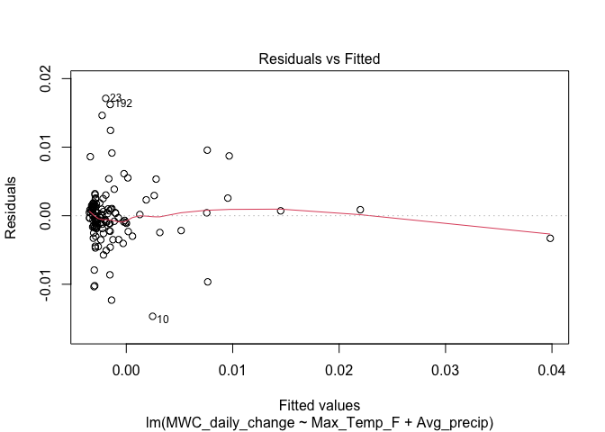

    plot(MLR_model_v5, 2)

    #Observations 10, 192, and 23 appear potentially influential.

    Jackknife_residuals_5<-rstudent(MLR_model_v5)

    Crystal_Lake_temperature_data_5$jackknife_resid <- NA
    used_rows <- as.numeric(rownames(model.frame(MLR_model_v5)))
    Crystal_Lake_temperature_data_5$jackknife_resid[used_rows] <- Jackknife_residuals_5

    n5=nrow(Crystal_Lake_temperature_data_5)
    k5=3
    p_value_10_new<-2*pt(abs(Crystal_Lake_temperature_data_5$jackknife_resid[10]), df=n5-k5-1, lower.tail=FALSE)
    p_value_192<-2*pt(abs(Crystal_Lake_temperature_data_5$jackknife_resid[192]), df=n5-k5-1, lower.tail=FALSE)
    p_value_23<-2*pt(abs(Crystal_Lake_temperature_data_5$jackknife_resid[23]), df=n5-k5-1, lower.tail=FALSE)

    p_value_10_new

    ## [1] 0.0005846235

    p_value_192

    ## [1] 0.0001759293

    p_value_23

    ## [1] 6.669408e-05

    Crystal_Lake_temperature_data_5$jackknife_resid[10]

    ## [1] -3.48574

    Crystal_Lake_temperature_data_5$jackknife_resid[192]

    ## [1] 3.811785

    Crystal_Lake_temperature_data_5$jackknife_resid[24]

    ## [1] 3.400733

All 3 points are statistically influential, with observation 192 having
the highest absolute residual value. I will regenerate the model a fifth
time with observation 192 removed.

    Crystal_Lake_temperature_data_6<-Crystal_Lake_temperature_data_5[-192, ]
    MLR_model_v6<-lm(MWC_daily_change~Max_Temp_F+Avg_precip, data=Crystal_Lake_temperature_data_6)
    summary(MLR_model_v6)

    ## 
    ## Call:
    ## lm(formula = MWC_daily_change ~ Max_Temp_F + Avg_precip, data = Crystal_Lake_temperature_data_6)
    ## 
    ## Residuals:
    ##        Min         1Q     Median         3Q        Max 
    ## -0.0148075 -0.0014507  0.0000203  0.0015103  0.0171096 
    ## 
    ## Coefficients:
    ##               Estimate Std. Error t value Pr(>|t|)    
    ## (Intercept) -2.124e-04  1.464e-03  -0.145   0.8849    
    ## Max_Temp_F  -3.764e-05  2.062e-05  -1.826   0.0702 .  
    ## Avg_precip   1.682e-02  1.252e-03  13.441   <2e-16 ***
    ## ---
    ## Signif. codes:  0 '***' 0.001 '**' 0.01 '*' 0.05 '.' 0.1 ' ' 1
    ## 
    ## Residual standard error: 0.004285 on 129 degrees of freedom
    ##   (108 observations deleted due to missingness)
    ## Multiple R-squared:  0.5834, Adjusted R-squared:  0.577 
    ## F-statistic: 90.34 on 2 and 129 DF,  p-value: < 2.2e-16

    plot(MLR_model_v6, 1)

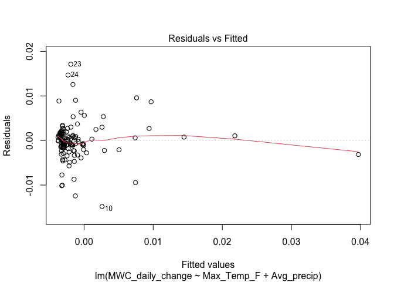

    plot(MLR_model_v6, 2)

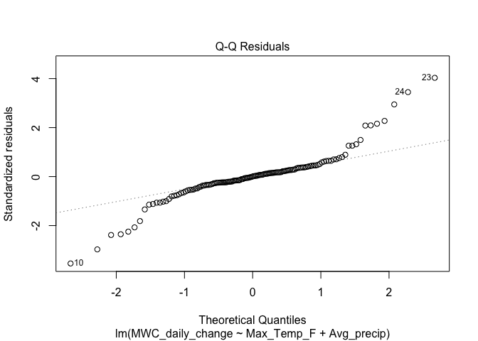

    #Observations 10, 23, and 24 appear potentially influential.

    Jackknife_residuals_6<-rstudent(MLR_model_v6)

    Crystal_Lake_temperature_data_6$jackknife_resid <- NA
    used_rows <- as.numeric(rownames(model.frame(MLR_model_v6)))
    Crystal_Lake_temperature_data_6$jackknife_resid[used_rows] <- Jackknife_residuals_6

    n6=nrow(Crystal_Lake_temperature_data_6)
    k6=3
    p_value_10_new<-2*pt(abs(Crystal_Lake_temperature_data_6$jackknife_resid[10]), df=n6-k6-1, lower.tail=FALSE)
    p_value_23<-2*pt(abs(Crystal_Lake_temperature_data_6$jackknife_resid[192]), df=n6-k6-1, lower.tail=FALSE)
    p_value_24_new<-2*pt(abs(Crystal_Lake_temperature_data_6$jackknife_resid[23]), df=n6-k6-1, lower.tail=FALSE)

    p_value_10_new

    ## [1] 0.0002510531

    p_value_23

    ## [1] 0.7893087

    p_value_24_new

    ## [1] 2.546716e-05

    Crystal_Lake_temperature_data_6$jackknife_resid[10]

    ## [1] -3.71782

    Crystal_Lake_temperature_data_6$jackknife_resid[23]

    ## [1] 4.295642

    Crystal_Lake_temperature_data_6$jackknife_resid[24]

    ## [1] 3.604685

The 23rd observation is not statistically influential at alpha=0.01.
Observations 10 and 24 are influential, and of these two data,
observation 10 has the higher absolute residual value. Thus, I
regenerate the model a sixth time, removing observation 10.

    Crystal_Lake_temperature_data_7<-Crystal_Lake_temperature_data_6[-10, ]
    MLR_model_v7<-lm(MWC_daily_change~Max_Temp_F+Avg_precip, data=Crystal_Lake_temperature_data_7)
    summary(MLR_model_v7)

    ## 
    ## Call:
    ## lm(formula = MWC_daily_change ~ Max_Temp_F + Avg_precip, data = Crystal_Lake_temperature_data_7)
    ## 
    ## Residuals:
    ##       Min        1Q    Median        3Q       Max 
    ## -0.013150 -0.001464 -0.000169  0.001598  0.016682 
    ## 
    ## Coefficients:
    ##               Estimate Std. Error t value Pr(>|t|)    
    ## (Intercept)  9.289e-04  1.430e-03   0.650  0.51705    
    ## Max_Temp_F  -5.285e-05  2.009e-05  -2.631  0.00955 ** 
    ## Avg_precip   1.711e-02  1.196e-03  14.302  < 2e-16 ***
    ## ---
    ## Signif. codes:  0 '***' 0.001 '**' 0.01 '*' 0.05 '.' 0.1 ' ' 1
    ## 
    ## Residual standard error: 0.004087 on 128 degrees of freedom
    ##   (108 observations deleted due to missingness)
    ## Multiple R-squared:  0.6157, Adjusted R-squared:  0.6097 
    ## F-statistic: 102.5 on 2 and 128 DF,  p-value: < 2.2e-16

    plot(MLR_model_v7, 1)

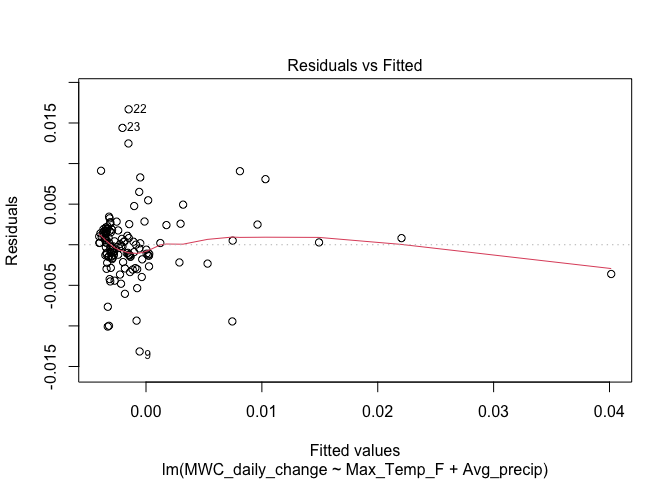

    plot(MLR_model_v7, 2)

    #Observations 9, 22, and 23 appear potentially influential.

    Jackknife_residuals_7<-rstudent(MLR_model_v7)

    Crystal_Lake_temperature_data_7$jackknife_resid <- NA
    used_rows <- as.numeric(rownames(model.frame(MLR_model_v7)))
    Crystal_Lake_temperature_data_7$jackknife_resid[used_rows] <- Jackknife_residuals_7

    n7=nrow(Crystal_Lake_temperature_data_7)
    k7=3
    p_value_9<-2*pt(abs(Crystal_Lake_temperature_data_7$jackknife_resid[9]), df=n7-k7-1, lower.tail=FALSE)
    p_value_22<-2*pt(abs(Crystal_Lake_temperature_data_7$jackknife_resid[22]), df=n7-k7-1, lower.tail=FALSE)
    p_value_23<-2*pt(abs(Crystal_Lake_temperature_data_7$jackknife_resid[23]), df=n7-k7-1, lower.tail=FALSE)

    p_value_9

    ## [1] 0.0006997745

    p_value_22

    ## [1] 1.570978e-05

    p_value_23

    ## [1] 0.0002511771

    Crystal_Lake_temperature_data_7$jackknife_resid[9]

    ## [1] -3.435253

    Crystal_Lake_temperature_data_7$jackknife_resid[22]

    ## [1] 4.410451

    Crystal_Lake_temperature_data_7$jackknife_resid[23]

    ## [1] 3.717933

All 3 points are influential, with observation 22 having the highest
abolsute residual value. I will regenerate the model a seventh time,
removing observation 22.

    Crystal_Lake_temperature_data_8<-Crystal_Lake_temperature_data_7[-22, ]
    MLR_model_v8<-lm(MWC_daily_change~Max_Temp_F+Avg_precip, data=Crystal_Lake_temperature_data_8)
    summary(MLR_model_v8)

    ## 
    ## Call:
    ## lm(formula = MWC_daily_change ~ Max_Temp_F + Avg_precip, data = Crystal_Lake_temperature_data_8)
    ## 
    ## Residuals:
    ##        Min         1Q     Median         3Q        Max 
    ## -0.0126440 -0.0013322  0.0000536  0.0015928  0.0146520 
    ## 
    ## Coefficients:
    ##               Estimate Std. Error t value Pr(>|t|)    
    ## (Intercept)  1.726e-04  1.348e-03   0.128   0.8983    
    ## Max_Temp_F  -4.393e-05  1.889e-05  -2.326   0.0216 *  
    ## Avg_precip   1.717e-02  1.118e-03  15.356   <2e-16 ***
    ## ---
    ## Signif. codes:  0 '***' 0.001 '**' 0.01 '*' 0.05 '.' 0.1 ' ' 1
    ## 
    ## Residual standard error: 0.00382 on 127 degrees of freedom
    ##   (108 observations deleted due to missingness)
    ## Multiple R-squared:   0.65,  Adjusted R-squared:  0.6445 
    ## F-statistic: 117.9 on 2 and 127 DF,  p-value: < 2.2e-16

    plot(MLR_model_v8, 1)

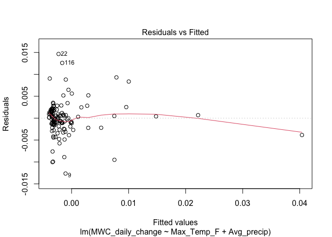

    plot(MLR_model_v8, 2)

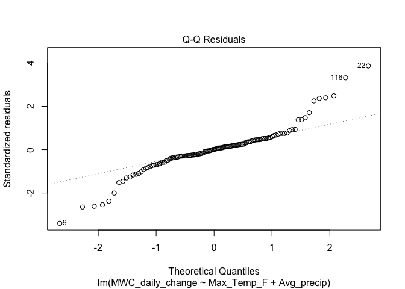

    #Observations 9, 22, and 116 appear potentially influential.

    Jackknife_residuals_8<-rstudent(MLR_model_v8)

    Crystal_Lake_temperature_data_8$jackknife_resid <- NA
    used_rows <- as.numeric(rownames(model.frame(MLR_model_v8)))
    Crystal_Lake_temperature_data_8$jackknife_resid[used_rows] <- Jackknife_residuals_8

    n8=nrow(Crystal_Lake_temperature_data_8)
    k8=3
    p_value_9<-2*pt(abs(Crystal_Lake_temperature_data_8$jackknife_resid[9]), df=n8-k8-1, lower.tail=FALSE)
    p_value_22<-2*pt(abs(Crystal_Lake_temperature_data_8$jackknife_resid[22]), df=n8-k8-1, lower.tail=FALSE)
    p_value_116<-2*pt(abs(Crystal_Lake_temperature_data_8$jackknife_resid[116]), df=n8-k8-1, lower.tail=FALSE)

    p_value_9

    ## [1] 0.0004729189

    p_value_22

    ## [1] 5.893695e-05

    p_value_116

    ## [1] 0.000660995

    Crystal_Lake_temperature_data_8$jackknife_resid[9]

    ## [1] -3.545649

    Crystal_Lake_temperature_data_8$jackknife_resid[22]

    ## [1] 4.091781

    Crystal_Lake_temperature_data_8$jackknife_resid[116]

    ## [1] 3.451654

    Crystal_Lake_temperature_data_9<-Crystal_Lake_temperature_data_8[-22, ]
    MLR_model_v9<-lm(MWC_daily_change~Max_Temp_F+Avg_precip, data=Crystal_Lake_temperature_data_9)
    summary(MLR_model_v9)

    ## 
    ## Call:
    ## lm(formula = MWC_daily_change ~ Max_Temp_F + Avg_precip, data = Crystal_Lake_temperature_data_9)
    ## 
    ## Residuals:
    ##        Min         1Q     Median         3Q        Max 
    ## -0.0123268 -0.0012593  0.0001839  0.0015968  0.0127198 
    ## 
    ## Coefficients:
    ##               Estimate Std. Error t value Pr(>|t|)    
    ## (Intercept) -2.751e-04  1.276e-03  -0.216   0.8296    
    ## Max_Temp_F  -3.927e-05  1.785e-05  -2.200   0.0297 *  
    ## Avg_precip   1.726e-02  1.055e-03  16.360   <2e-16 ***
    ## ---
    ## Signif. codes:  0 '***' 0.001 '**' 0.01 '*' 0.05 '.' 0.1 ' ' 1
    ## 
    ## Residual standard error: 0.003604 on 126 degrees of freedom
    ##   (108 observations deleted due to missingness)
    ## Multiple R-squared:  0.6799, Adjusted R-squared:  0.6748 
    ## F-statistic: 133.8 on 2 and 126 DF,  p-value: < 2.2e-16

    plot(MLR_model_v9, 1)

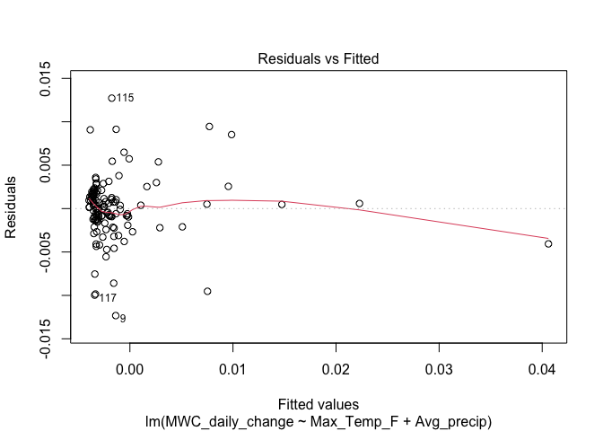

    plot(MLR_model_v9, 2)

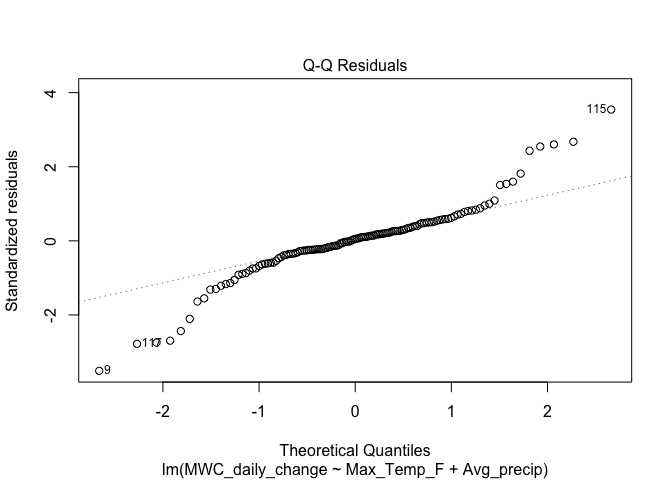

    Jackknife_residuals_9<-rstudent(MLR_model_v9)

    Crystal_Lake_temperature_data_9$jackknife_resid <- NA
    used_rows <- as.numeric(rownames(model.frame(MLR_model_v9)))
    Crystal_Lake_temperature_data_9$jackknife_resid[used_rows] <- Jackknife_residuals_9

    n9=nrow(Crystal_Lake_temperature_data_9)
    k9=3
    p_value_9<-2*pt(abs(Crystal_Lake_temperature_data_9$jackknife_resid[9]), df=n9-k9-1, lower.tail=FALSE)
    p_value_115<-2*pt(abs(Crystal_Lake_temperature_data_9$jackknife_resid[115]), df=n9-k9-1, lower.tail=FALSE)
    p_value_117<-2*pt(abs(Crystal_Lake_temperature_data_9$jackknife_resid[117]), df=n9-k9-1, lower.tail=FALSE)

    p_value_9

    ## [1] 0.0002901043

    p_value_115

    ## [1] 0.0002498983

    p_value_117

    ## [1] 0.004624448

    Crystal_Lake_temperature_data_9$jackknife_resid[9]

    ## [1] -3.679691

    Crystal_Lake_temperature_data_9$jackknife_resid[115]

    ## [1] 3.719794

    Crystal_Lake_temperature_data_9$jackknife_resid[117]

    ## [1] -2.859752

    Crystal_Lake_temperature_data_10<-Crystal_Lake_temperature_data_9[-115, ]
    MLR_model_v10<-lm(MWC_daily_change~Max_Temp_F+Avg_precip, data=Crystal_Lake_temperature_data_10)
    summary(MLR_model_v10)

    ## 
    ## Call:
    ## lm(formula = MWC_daily_change ~ Max_Temp_F + Avg_precip, data = Crystal_Lake_temperature_data_10)
    ## 
    ## Residuals:
    ##        Min         1Q     Median         3Q        Max 
    ## -0.0122305 -0.0011594  0.0002622  0.0015736  0.0095396 
    ## 
    ## Coefficients:
    ##               Estimate Std. Error t value Pr(>|t|)    
    ## (Intercept) -3.673e-04  1.216e-03  -0.302   0.7630    
    ## Max_Temp_F  -3.941e-05  1.701e-05  -2.318   0.0221 *  
    ## Avg_precip   1.729e-02  1.005e-03  17.203   <2e-16 ***
    ## ---
    ## Signif. codes:  0 '***' 0.001 '**' 0.01 '*' 0.05 '.' 0.1 ' ' 1
    ## 
    ## Residual standard error: 0.003433 on 125 degrees of freedom
    ##   (108 observations deleted due to missingness)
    ## Multiple R-squared:  0.7031, Adjusted R-squared:  0.6983 
    ## F-statistic:   148 on 2 and 125 DF,  p-value: < 2.2e-16

    plot(MLR_model_v10, 1)

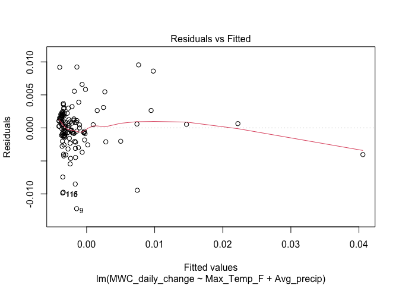

    plot(MLR_model_v10, 2)

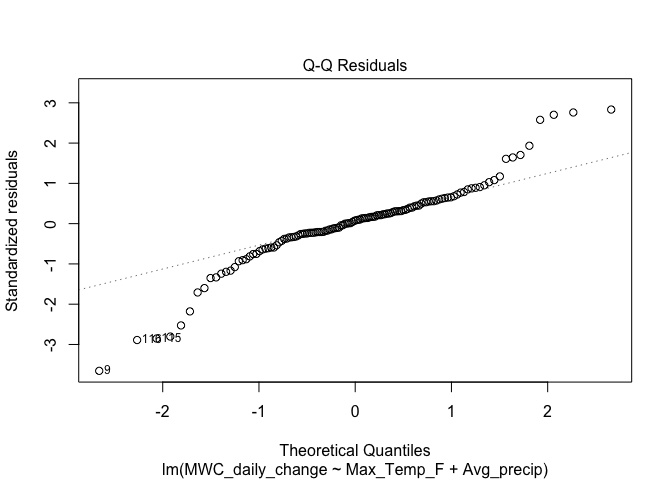

    Jackknife_residuals_10<-rstudent(MLR_model_v10)

    Crystal_Lake_temperature_data_10$jackknife_resid <- NA
    used_rows <- as.numeric(rownames(model.frame(MLR_model_v10)))
    Crystal_Lake_temperature_data_10$jackknife_resid[used_rows] <- Jackknife_residuals_10

    n10=nrow(Crystal_Lake_temperature_data_10)
    k10=3
    p_value_9<-2*pt(abs(Crystal_Lake_temperature_data_10$jackknife_resid[9]), df=n10-k10-1, lower.tail=FALSE)
    p_value_115<-2*pt(abs(Crystal_Lake_temperature_data_10$jackknife_resid[115]), df=n10-k10-1, lower.tail=FALSE)
    p_value_116<-2*pt(abs(Crystal_Lake_temperature_data_10$jackknife_resid[116]), df=n10-k10-1, lower.tail=FALSE)

    p_value_9

    ## [1] 0.0001516602

    p_value_115

    ## [1] 0.00363717

    p_value_116

    ## [1] 0.003197898

    Crystal_Lake_temperature_data_10$jackknife_resid[9]

    ## [1] -3.85194

    Crystal_Lake_temperature_data_10$jackknife_resid[115]

    ## [1] -2.937942

    Crystal_Lake_temperature_data_10$jackknife_resid[116]

    ## [1] -2.97913

    Crystal_Lake_temperature_data_11<-Crystal_Lake_temperature_data_10[-9, ]
    MLR_model_v11<-lm(MWC_daily_change~Max_Temp_F+Avg_precip, data=Crystal_Lake_temperature_data_11)
    summary(MLR_model_v11)

    ## 
    ## Call:
    ## lm(formula = MWC_daily_change ~ Max_Temp_F + Avg_precip, data = Crystal_Lake_temperature_data_11)
    ## 
    ## Residuals:
    ##        Min         1Q     Median         3Q        Max 
    ## -0.0098303 -0.0011980  0.0000562  0.0017129  0.0093567 
    ## 
    ## Coefficients:
    ##               Estimate Std. Error t value Pr(>|t|)    
    ## (Intercept)  6.367e-04  1.183e-03   0.538  0.59123    
    ## Max_Temp_F  -5.235e-05  1.648e-05  -3.176  0.00188 ** 
    ## Avg_precip   1.728e-02  9.537e-04  18.120  < 2e-16 ***
    ## ---
    ## Signif. codes:  0 '***' 0.001 '**' 0.01 '*' 0.05 '.' 0.1 ' ' 1
    ## 
    ## Residual standard error: 0.003257 on 124 degrees of freedom
    ##   (108 observations deleted due to missingness)
    ## Multiple R-squared:  0.7263, Adjusted R-squared:  0.7219 
    ## F-statistic: 164.6 on 2 and 124 DF,  p-value: < 2.2e-16

    plot(MLR_model_v11, 1)

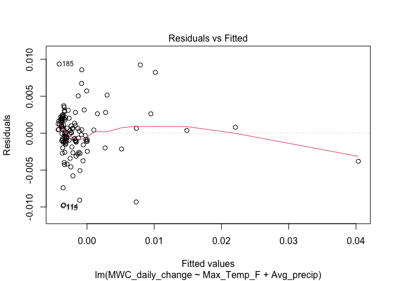

    plot(MLR_model_v11, 2)

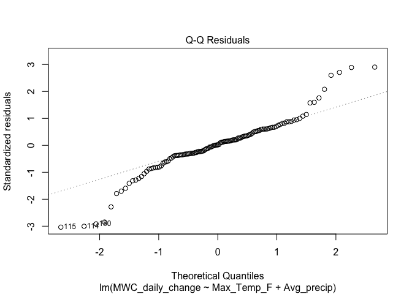

    Jackknife_residuals_11<-rstudent(MLR_model_v11)

    Crystal_Lake_temperature_data_11$jackknife_resid <- NA
    used_rows <- as.numeric(rownames(model.frame(MLR_model_v11)))
    Crystal_Lake_temperature_data_11$jackknife_resid[used_rows] <- Jackknife_residuals_11

    n11=nrow(Crystal_Lake_temperature_data_11)
    k11=3
    p_value_114<-2*pt(abs(Crystal_Lake_temperature_data_11$jackknife_resid[114]), df=n11-k11-1, lower.tail=FALSE)
    p_value_115<-2*pt(abs(Crystal_Lake_temperature_data_11$jackknife_resid[115]), df=n11-k11-1, lower.tail=FALSE)
    p_value_180<-2*pt(abs(Crystal_Lake_temperature_data_11$jackknife_resid[180]), df=n11-k11-1, lower.tail=FALSE)

    p_value_114

    ## [1] 0.002124393

    p_value_115

    ## [1] 0.001895162

    p_value_180

    ## [1] 0.002921629

    Crystal_Lake_temperature_data_11$jackknife_resid[114]

    ## [1] -3.107339

    Crystal_Lake_temperature_data_11$jackknife_resid[115]

    ## [1] -3.142365

    Crystal_Lake_temperature_data_11$jackknife_resid[180]

    ## [1] -3.007922

After removing 10 influential observation, I have reached the point
where only 1 influential observation remains: observation 115. I will
regenerate the model for the eleventh time, removing observation 115.

    Crystal_Lake_temperature_data_12<-Crystal_Lake_temperature_data_11[-115, ]
    MLR_model_v12<-lm(MWC_daily_change~Max_Temp_F+Avg_precip, data=Crystal_Lake_temperature_data_12)
    summary(MLR_model_v12)

    ## 
    ## Call:
    ## lm(formula = MWC_daily_change ~ Max_Temp_F + Avg_precip, data = Crystal_Lake_temperature_data_12)
    ## 
    ## Residuals:
    ##        Min         1Q     Median         3Q        Max 
    ## -0.0098442 -0.0012407  0.0000162  0.0016144  0.0092460 
    ## 
    ## Coefficients:
    ##               Estimate Std. Error t value Pr(>|t|)    
    ## (Intercept)  5.352e-04  1.143e-03   0.468  0.64037    
    ## Max_Temp_F  -4.964e-05  1.595e-05  -3.113  0.00231 ** 
    ## Avg_precip   1.718e-02  9.219e-04  18.631  < 2e-16 ***
    ## ---
    ## Signif. codes:  0 '***' 0.001 '**' 0.01 '*' 0.05 '.' 0.1 ' ' 1
    ## 
    ## Residual standard error: 0.003147 on 123 degrees of freedom
    ##   (108 observations deleted due to missingness)
    ## Multiple R-squared:  0.7386, Adjusted R-squared:  0.7344 
    ## F-statistic: 173.8 on 2 and 123 DF,  p-value: < 2.2e-16

    plot(MLR_model_v12, 1)

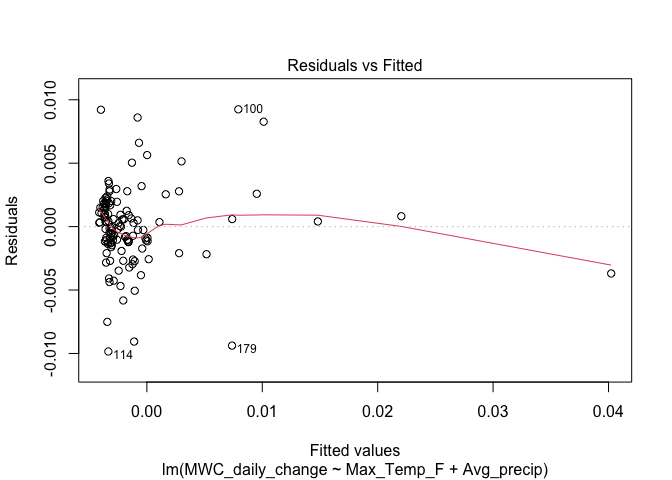

    plot(MLR_model_v12, 2)

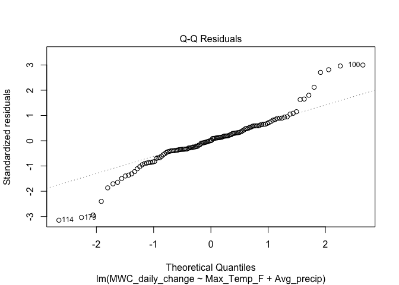

    Jackknife_residuals_12<-rstudent(MLR_model_v12)

    Crystal_Lake_temperature_data_12$jackknife_resid <- NA
    used_rows <- as.numeric(rownames(model.frame(MLR_model_v12)))
    Crystal_Lake_temperature_data_12$jackknife_resid[used_rows] <- Jackknife_residuals_12

    n12=nrow(Crystal_Lake_temperature_data_12)
    k12=3
    p_value_100<-2*pt(abs(Crystal_Lake_temperature_data_12$jackknife_resid[100]), df=n12-k12-1, lower.tail=FALSE)
    p_value_114<-2*pt(abs(Crystal_Lake_temperature_data_12$jackknife_resid[114]), df=n12-k12-1, lower.tail=FALSE)
    p_value_179<-2*pt(abs(Crystal_Lake_temperature_data_12$jackknife_resid[179]), df=n12-k12-1, lower.tail=FALSE)

    p_value_100

    ## [1] 0.002181643

    p_value_114

    ## [1] 0.001253988

    p_value_179

    ## [1] 0.001867439

    Crystal_Lake_temperature_data_12$jackknife_resid[100]

    ## [1] 3.09929

    Crystal_Lake_temperature_data_12$jackknife_resid[114]

    ## [1] -3.266773

    Crystal_Lake_temperature_data_12$jackknife_resid[179]

    ## [1] -3.147023

We are back to three influential observations; however, for the sake of
space, I will stop the Jackknifing process here and use MLR\_model\_v12
for inference and predictions.

    summary(MLR_model_v12)

    ## 
    ## Call:
    ## lm(formula = MWC_daily_change ~ Max_Temp_F + Avg_precip, data = Crystal_Lake_temperature_data_12)
    ## 
    ## Residuals:
    ##        Min         1Q     Median         3Q        Max 
    ## -0.0098442 -0.0012407  0.0000162  0.0016144  0.0092460 
    ## 
    ## Coefficients:
    ##               Estimate Std. Error t value Pr(>|t|)    
    ## (Intercept)  5.352e-04  1.143e-03   0.468  0.64037    
    ## Max_Temp_F  -4.964e-05  1.595e-05  -3.113  0.00231 ** 
    ## Avg_precip   1.718e-02  9.219e-04  18.631  < 2e-16 ***
    ## ---
    ## Signif. codes:  0 '***' 0.001 '**' 0.01 '*' 0.05 '.' 0.1 ' ' 1
    ## 
    ## Residual standard error: 0.003147 on 123 degrees of freedom
    ##   (108 observations deleted due to missingness)
    ## Multiple R-squared:  0.7386, Adjusted R-squared:  0.7344 
    ## F-statistic: 173.8 on 2 and 123 DF,  p-value: < 2.2e-16

Interpretation of model:

- 73.86% of the sample variation in MWC\_daily\_change is explained
  through linear relationships with Max\_Temp\_F and Avg\_precip.

- Based on the sample, we expect MWC\_daily\_change to decrease by
  4.964\*10^-5 m^3 water/m^3 soil per 1 degree Fahrenheit increase in
  Max\_Temp\_F, holding Avg\_precip constant. This physically makes
  sense since higher daily temperature yields higher evaporation rates,
  thereby yielding more dramatic decreases in soil water content.

- We expect MWC\_daily\_change to increase by 0.01718 m^3 water/m^3 soil
  per 1-inch increase in Avg\_precip, holding Max\_Temp\_F constant.
  This physically makes sense since precipitation increases soil
  moisture.

- The model has a significantly better overall fitting performance than
  the null regression plane at the sample mean of MWC\_daily\_change (as
  indicated by the small p value of the overall F test).

- Both predictors significantly improve the fitting performance of the
  model including only the other predictor, as indicated by the small p
  values of the t tests for those individual predictors (which are
  statistically equivalent to single partial F tests between the
  respective reduced models and the full model containing both
  predictors).

An important point to note with this model:

Before removing any influential observations, the p value for the t test
statistic associated with the Max\_Temp\_F variable was 0.8372, meaning
that it did not significantly improve the fitting performance of the
model already including the Avg\_precip variable. However, after
removing some influential observations, this t test statistic became
significant at alpha=0.05, taking on a value of 0.00231. This means
that, when influential observations are accounted for, Max\_Temp\_F does
significantly contribute to the model’s fitting performance. When I
originally created this regression model for my research poster, I did
not do any Jackknifing as I had not learned it yet in my Regression
Analysis class. When I did learn about jackknife residuals, I was
occupied with writing the proposal for future research and did not think
to remove influential observations from the model. Thus, my poster
states that Max\_Temp\_F is not significant.

Thankfully, this was a preliminary model created from temperature and
precipitation data collected from proxy sources. Future research will
utilize on-site temperature sensors and precipitation gauges to
eliminate uncertainty associated with spatial variability. It was thus a
low-stakes opportunity to learn an important lesson that I will carry
with me for the rest of my career: ALWAYS check for influential
observations every time I run a regression model. Not only do
influential observations affect parameter estimates, they can also
dramatically change the p values of partial significance hypothesis
tests, affecting a researcher’s decision making.

Moving on to test for multicollinearity:

    VIF(MLR_model_v12)

    ## Max_Temp_F Avg_precip 
    ##   1.016896   1.016896

Variance inflation factors are very low (close to 1) for both
predictors, yielding no evidence of multicollinearity. Mathematically,
this means that the model regressing Max\_Temp\_F on Avg\_precip and the
model regressing Avg\_precip on Max\_Temp\_F both have very low R
squared values, since *V**I**F*(*j*) = 1/(1 − *R**j*2).

Moving on to inference using the model. Remember that the response
variable is MWC\_daily\_change, meaning the model predicts the increase
or decrease in mean water content between the previous day and the
current day. Let’s choose two random consecutive observations from the
data and run the model on the more recent observation.

    obs49<-Crystal_Lake_temperature_data_12[49, ]
    obs50<-Crystal_Lake_temperature_data_12[50, ]
    MWC_daily_change_actual<-obs50$MWC-obs49$MWC
    obs49

    ## # A tibble: 1 × 8
    ##   Date       Max_Temp_F Min_Temp_F   MWC Avg_precip Avg_temp_F MWC_daily_change
    ##   <date>          <dbl>      <dbl> <dbl>      <dbl>      <dbl>            <dbl>
    ## 1 2025-03-30         73         42 0.196     0.0633       57.5         -0.00143
    ## # ℹ 1 more variable: jackknife_resid <dbl>

    obs50

    ## # A tibble: 1 × 8
    ##   Date       Max_Temp_F Min_Temp_F   MWC Avg_precip Avg_temp_F MWC_daily_change
    ##   <date>          <dbl>      <dbl> <dbl>      <dbl>      <dbl>            <dbl>
    ## 1 2025-03-31         73         32 0.197      0.243       52.5          0.00144
    ## # ℹ 1 more variable: jackknife_resid <dbl>

    MWC_daily_change_actual

    ## [1] 0.001444444

Under Max\_Temp\_F=73 degrees F and Avg\_precip=0.2433333, a change in
MWC of 0.00144 was observed. Let’s see what the model predicts will
happen to MWC under these conditions.

    newdata<-data.frame(Max_Temp_F=73, Avg_precip=0.2433333)
    predict(MLR_model_v12, newdata, interval="prediction", level=0.95)

    ##           fit          lwr        upr
    ## 1 0.001091453 -0.005167444 0.00735035

The model predicts a 1-day change in MWC of about 0.00109 m^3 water/m^3
of soil for a single day with these atmospheric conditions, which is
similar to the actual observed value.

After soil cover materials and onsite temperature sensors and
precipitation gauges are installed, the future regression model will
include the following variables:

- WC\_daily\_change (continuous): the response variable, measuring how
  much the average daily water content for a given pot has changed
  between the previous day and the current day

- pot\_no (categorical): the number of the pot (1-12) as previously
  labeled

- daily\_precip (continuous): the raw onsite measurement of daily
  precipitation as recorded by the precipitation gauge

- daily\_max\_temp\_F (continuous): the onsite measurement of daily
  maximum temperature as recorded by the temperature sensor

- cover\_material\_type (categorical): the cover material on top of each
  pot (permeable tile, cement, vegetation, or nothing)
