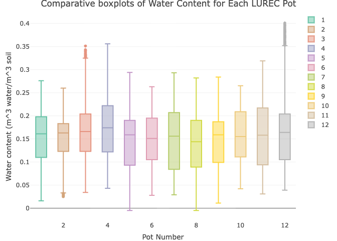

    ## Warning: package 'ggplot2' was built under R version 4.4.3

    ## Warning: package 'tibble' was built under R version 4.4.3

    ## Warning: package 'tidyr' was built under R version 4.4.3

    ## Warning: package 'readr' was built under R version 4.4.3

    ## Warning: package 'purrr' was built under R version 4.4.3

    ## Warning: package 'dplyr' was built under R version 4.4.3

    ## ── Attaching core tidyverse packages ──────────────────────── tidyverse 2.0.0 ──
    ## ✔ dplyr     1.2.0     ✔ readr     2.1.6
    ## ✔ forcats   1.0.1     ✔ stringr   1.6.0
    ## ✔ ggplot2   4.0.2     ✔ tibble    3.3.1
    ## ✔ lubridate 1.9.4     ✔ tidyr     1.3.2
    ## ✔ purrr     1.2.1     
    ## ── Conflicts ────────────────────────────────────────── tidyverse_conflicts() ──
    ## ✖ dplyr::filter() masks stats::filter()
    ## ✖ dplyr::lag()    masks stats::lag()
    ## ℹ Use the conflicted package (<http://conflicted.r-lib.org/>) to force all conflicts to become errors

    ## Warning: package 'plotly' was built under R version 4.4.3

    ## 
    ## Attaching package: 'plotly'
    ## 
    ## The following object is masked from 'package:ggplot2':
    ## 
    ##     last_plot
    ## 
    ## The following object is masked from 'package:stats':
    ## 
    ##     filter
    ## 
    ## The following object is masked from 'package:graphics':
    ## 
    ##     layout

The very first action taken, before the project began, was downloading
nearby precipitation data from this site:
<https://www.ncei.noaa.gov/access/past-weather/Woodstock%2C%20Illinois.>

This was later visualized against the soil water content data from the
field site.

    ## Warning: One or more parsing issues, call `problems()` on your data frame for details,
    ## e.g.:
    ##   dat <- vroom(...)
    ##   problems(dat)

    ## Rows: 6525 Columns: 7
    ## ── Column specification ────────────────────────────────────────────────────────
    ## Delimiter: ","
    ## chr (1): Date
    ## dbl (3): PRCP (Inches), SNOW (Inches), SNWD (Inches)
    ## lgl (3): TAVG (Degrees Fahrenheit), TMAX (Degrees Fahrenheit), TMIN (Degrees...
    ## 
    ## ℹ Use `spec()` to retrieve the full column specification for this data.
    ## ℹ Specify the column types or set `show_col_types = FALSE` to quiet this message.

    ## Warning: One or more parsing issues, call `problems()` on your data frame for details,
    ## e.g.:
    ##   dat <- vroom(...)
    ##   problems(dat)

    ## Rows: 6402 Columns: 7
    ## ── Column specification ────────────────────────────────────────────────────────
    ## Delimiter: ","
    ## chr (1): Date
    ## dbl (3): PRCP (Inches), SNOW (Inches), SNWD (Inches)
    ## lgl (3): TAVG (Degrees Fahrenheit), TMAX (Degrees Fahrenheit), TMIN (Degrees...
    ## 
    ## ℹ Use `spec()` to retrieve the full column specification for this data.
    ## ℹ Specify the column types or set `show_col_types = FALSE` to quiet this message.

    ## Warning: One or more parsing issues, call `problems()` on your data frame for details,
    ## e.g.:
    ##   dat <- vroom(...)
    ##   problems(dat)

    ## Rows: 8208 Columns: 7
    ## ── Column specification ────────────────────────────────────────────────────────
    ## Delimiter: ","
    ## chr (1): Date
    ## dbl (3): PRCP (Inches), SNOW (Inches), SNWD (Inches)
    ## lgl (3): TAVG (Degrees Fahrenheit), TMAX (Degrees Fahrenheit), TMIN (Degrees...
    ## 
    ## ℹ Use `spec()` to retrieve the full column specification for this data.
    ## ℹ Specify the column types or set `show_col_types = FALSE` to quiet this message.

I then prepared the data for visualization and analysis by reformatting
each date field to date class, filtering rows for 2025, and combining
each station’s data into a single dataset.

    Woodstock_0.7_SW_data<-Woodstock_0.7_SW_data%>%
      mutate(Date=ymd(Date))%>%
      mutate(Year=year(Date), Month=month(Date), Day=day(Date))%>%
      filter(Year==2025)%>%
      select(c(1,5,8,9,10))

    ## Warning: There was 1 warning in `mutate()`.
    ## ℹ In argument: `Date = ymd(Date)`.
    ## Caused by warning:
    ## !  2 failed to parse.

    Woodstock_3.8_SW_data<-Woodstock_3.8_SW_data%>%
      mutate(Date=ymd(Date))%>%
      mutate(Year=year(Date), Month=month(Date), Day=day(Date))%>%
      filter(Year==2025)%>%
      select(c(1,5,8,9,10))

    ## Warning: There was 1 warning in `mutate()`.
    ## ℹ In argument: `Date = ymd(Date)`.
    ## Caused by warning:
    ## !  2 failed to parse.

    Woodstock_5_NW_data<-Woodstock_5_NW_data%>%
      mutate(Date=ymd(Date))%>%
      mutate(Year=year(Date), Month=month(Date), Day=day(Date))%>%
      filter(Year==2025)%>%
      select(c(1,5,8,9,10))

    ## Warning: There was 1 warning in `mutate()`.
    ## ℹ In argument: `Date = ymd(Date)`.
    ## Caused by warning:
    ## !  2 failed to parse.

    Woodstock_combined_weather_data<-Woodstock_0.7_SW_data%>%
      left_join(Woodstock_3.8_SW_data, by=c("Date"="Date"))%>%
      left_join(Woodstock_5_NW_data, by=c("Date"="Date"))%>%
      select(1,2,6,10)

    names(Woodstock_combined_weather_data)<-c("Date","SW_0.7_Precip", "SW_3.8_Precip", "NW_5_Precip")

At the onset of my Environmental Research class in January, I obtained
the onsite soil moisture data from my professor, which includes moisture
data from November 10, 2024 (just after being installed) to October 6,
2025.

    six_LUREC_water_sensor_data<-read_csv("~/Desktop/Ghatak_research_project/6_LUREC_soil_water_sensors.csv")

    ## New names:
    ## Rows: 7918 Columns: 9
    ## ── Column specification
    ## ──────────────────────────────────────────────────────── Delimiter: "," chr
    ## (9): z6B03659, Port 1, Port 2, Port 3, Port 4, Port 5, Port 6, Port 7......
    ## ℹ Use `spec()` to retrieve the full column specification for this data. ℹ
    ## Specify the column types or set `show_col_types = FALSE` to quiet this message.
    ## • `Port 7` -> `Port 7...8`
    ## • `Port 7` -> `Port 7...9`

    six__more_LUREC_water_sensors<-read_csv("~/Desktop/Ghatak_research_project/6_more_LUREC_water_sensors.csv")

    ## New names:
    ## Rows: 7912 Columns: 9
    ## ── Column specification
    ## ──────────────────────────────────────────────────────── Delimiter: "," chr
    ## (9): z6B03782, Port 1, Port 2, Port 3, Port 4, Port 5, Port 6, Port 7......
    ## ℹ Use `spec()` to retrieve the full column specification for this data. ℹ
    ## Specify the column types or set `show_col_types = FALSE` to quiet this message.
    ## • `Port 7` -> `Port 7...8`
    ## • `Port 7` -> `Port 7...9`

Each dataset contains readings from a single data logger, which receives
data from six of the twelve sensors (2 datasets = 2 data loggers = 12
total sensors).

I then performed some basic data cleaning, including removal of column
headers that were formatted as observations and renaming columns to
prevent word splitting issues, and changing water content readings from
character to numeric class.

    six_LUREC_water_sensor_data_new<-six_LUREC_water_sensor_data%>%
    tail(7916)
    colnames(six_LUREC_water_sensor_data_new)<-c("Timestamp", "Pot_1_Water_Content_proportion", "Pot_2_Water_Content_proportion", "Pot_3_Water_Content_proportion", "Pot_4_Water_Content_proportion", "Pot_5_Water_Content_proportion", "Pot_6_Water_Content_proportion", "Battery_percent", "Battery_voltage_mV")

    six__more_LUREC_water_sensors_new<-six__more_LUREC_water_sensors%>%
    tail(7910)
    colnames(six__more_LUREC_water_sensors_new)<-c("Timestamp", "Pot_7_Water_Content_proportion", "Pot_8_Water_Content_proportion", "Pot_9_Water_Content_proportion", "Pot_10_Water_Content_proportion", "Pot_11_Water_Content_proportion", "Pot_12_Water_Content_proportion", "Battery_percent", "Battery_voltage_mV")

    rm(six_LUREC_water_sensor_data, six__more_LUREC_water_sensors)

    six_LUREC_water_sensor_data_new<-six_LUREC_water_sensor_data_new%>%
    mutate(Pot_1_Water_Content_proportion=as.numeric(Pot_1_Water_Content_proportion))%>%
    mutate(Pot_2_Water_Content_proportion=as.numeric(Pot_2_Water_Content_proportion))%>%
    mutate(Pot_3_Water_Content_proportion=as.numeric(Pot_3_Water_Content_proportion))%>%
    mutate(Pot_4_Water_Content_proportion=as.numeric(Pot_4_Water_Content_proportion))%>%
    mutate(Pot_5_Water_Content_proportion=as.numeric(Pot_5_Water_Content_proportion))%>%
    mutate(Pot_6_Water_Content_proportion=as.numeric(Pot_6_Water_Content_proportion))

    six_more_LUREC_water_sensors_new<-six__more_LUREC_water_sensors_new%>%
      mutate(Pot_7_Water_Content_proportion=as.numeric(Pot_7_Water_Content_proportion))%>%
      mutate(Pot_8_Water_Content_proportion=as.numeric(Pot_8_Water_Content_proportion))%>%
      mutate(Pot_9_Water_Content_proportion=as.numeric(Pot_9_Water_Content_proportion))%>%
      mutate(Pot_10_Water_Content_proportion=as.numeric(Pot_10_Water_Content_proportion))%>%
      mutate(Pot_11_Water_Content_proportion=as.numeric(Pot_11_Water_Content_proportion))%>%
      mutate(Pot_12_Water_Content_proportion=as.numeric(Pot_12_Water_Content_proportion))

    ## Warning: There was 1 warning in `mutate()`.
    ## ℹ In argument: `Pot_7_Water_Content_proportion =
    ##   as.numeric(Pot_7_Water_Content_proportion)`.
    ## Caused by warning:
    ## ! NAs introduced by coercion

    ## Warning: There was 1 warning in `mutate()`.
    ## ℹ In argument: `Pot_10_Water_Content_proportion =
    ##   as.numeric(Pot_10_Water_Content_proportion)`.
    ## Caused by warning:
    ## ! NAs introduced by coercion

    rm(six__more_LUREC_water_sensors_new)

I then investigated the distribution of each pot’s water content.

    Combined_LUREC_water_data<-six_LUREC_water_sensor_data_new%>%
    tail(7915)%>%
    left_join(six_more_LUREC_water_sensors_new, by=c("Timestamp"="Timestamp"))

    Combined_LUREC_water_data_pivoted<-Combined_LUREC_water_data%>%
    select(-Battery_percent.x, -Battery_voltage_mV.x, -Battery_percent.y, -Battery_voltage_mV.y)%>%
    pivot_longer(cols=-Timestamp, names_to="Pot", values_to="Water_content")

    Combined_LUREC_water_data_pivoted$Pot<-rep(1:12, 7915)
    Combined_LUREC_water_data_pivoted$Pot<-as.factor(Combined_LUREC_water_data_pivoted$Pot)

    Pot_water_content_boxplots<-plot_ly(data=Combined_LUREC_water_data_pivoted, color=~Pot, y=~Water_content, type="box")%>%
    layout(title="Comparative boxplots of Water Content for Each LUREC Pot", xaxis=list(title="Pot Number"), yaxis=list(title="Water content (m^3 water/m^3 soil"))
    Pot_water_content_boxplots

    ## Warning: Ignoring 2999 observations

    ## Warning in RColorBrewer::brewer.pal(max(N, 3L), "Set2"): n too large, allowed maximum for palette Set2 is 8
    ## Returning the palette you asked for with that many colors
    ## Warning in RColorBrewer::brewer.pal(max(N, 3L), "Set2"): n too large, allowed maximum for palette Set2 is 8
    ## Returning the palette you asked for with that many colors

Creating this boxplot made it visually apparent that pots 5 and 8
contained negative values. Since soil moisture content is measured as a
proportion of cubic meters of water per cubic meter of soil, negative
moisture readings make no sense.

I then investigated when these negative readings occured.

    Pot_5_negative_values<-Combined_LUREC_water_data%>%
    select(Timestamp, Pot_5_Water_Content_proportion)%>%
    filter(Pot_5_Water_Content_proportion<0)

    Pot_8_negative_values<-Combined_LUREC_water_data%>%
    select(Timestamp, Pot_8_Water_Content_proportion)%>%
    filter(Pot_8_Water_Content_proportion<0)

The sensor in Pot 5 recorded negative values for water content at each
hour mark from 1/21/25 at 9:00 AM to 1/22/25 at 7:00 PM. The sensor in
Pot 8 recorded negative values for water content at each hour mark from
10:00 AM to 5:00 PM on 1/21/26. The negative values then discontinue and
begin again from 12:00 AM to 5:00 PM on 1/22/25.

Based on this information and the locations of large clusters of NA
values between the months of November and January for 2 of the pots, I
decided to remove all observations at or before 2/3/25, after averaging
the observations by day. This was the dataset used for all subsequent
analyses.

    Averaged_LUREC_water_data<-Combined_LUREC_water_data%>%
    mutate(Timestamp=mdy_hm(Timestamp))%>%
    mutate(Day=format(Timestamp, format= "%d"), Month=format(Timestamp, format="%m"), Year=format(Timestamp, format="%y"))%>%
    mutate(Date=str_c(Month, "/", Day, "/", Year))%>%
    mutate(Date=mdy(Date))%>%
    group_by(Date)%>%
    summarize(Pot_1_mean_water_content=mean(Pot_1_Water_Content_proportion), Pot_2_mean_water_content=mean(Pot_2_Water_Content_proportion), Pot_3_mean_water_content=mean(Pot_3_Water_Content_proportion), Pot_4_mean_water_content=mean(Pot_4_Water_Content_proportion), Pot_5_mean_water_content=mean(Pot_5_Water_Content_proportion), Pot_6_mean_water_content=mean(Pot_6_Water_Content_proportion), Pot_7_mean_water_content=mean(Pot_7_Water_Content_proportion), Pot_8_mean_water_content=mean(Pot_8_Water_Content_proportion), Pot_9_mean_water_content=mean(Pot_9_Water_Content_proportion), Pot_10_mean_water_content=mean(Pot_10_Water_Content_proportion), Pot_11_mean_water_content=mean(Pot_11_Water_Content_proportion), Pot_12_mean_water_content=mean(Pot_12_Water_Content_proportion)) 

    Water_content_precipitation_combined<-Averaged_LUREC_water_data%>%
    left_join(Woodstock_combined_weather_data, by=c("Date"="Date"))%>%
    mutate(Avg_MWC=(Pot_1_mean_water_content+Pot_2_mean_water_content+Pot_3_mean_water_content+Pot_4_mean_water_content+Pot_5_mean_water_content+Pot_6_mean_water_content+Pot_7_mean_water_content+Pot_8_mean_water_content+Pot_9_mean_water_content+Pot_10_mean_water_content+Pot_11_mean_water_content+Pot_12_mean_water_content)/12)

    Useful_LUREC_averaged_data<-Water_content_precipitation_combined%>%
    filter(Date > "2025-02-03")

I then created a three-axis time series graph displaying daily averaged
water content against the daily precipitation and maximum temperature at
the Crystal Lake 4 NW weather station (the only weather station near the
field site with both temperature and precipitation data for 2025). Data
for this weather station was downloaded from the same website as the
three Woodstock stations.
